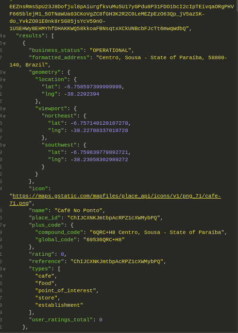

# Coffe API

  
  

    This API, is for a application who create and mark Coffe shops on the Google Maps API.

#### E.g:

#### Dependencies

- `gem 'pg', '>= 0.18', '< 2.0'`
- `gem 'rails', '~> 6.0.3', '>= 6.0.3.4'`
- `ruby 2.7.2`